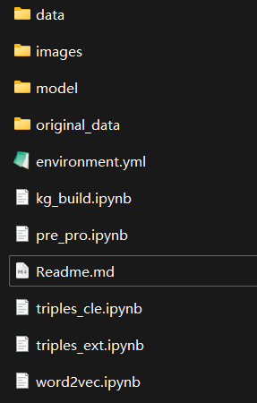

整个项目使用的环境依赖都在environment.yml中，使用该环境文件创建conda环境的命令如下

```
conda env create -n KG -f environment.yml
```

项目的目录结构如下



- data文件夹是运行程序过程中产生的结果文件，因为中间文件过多所以我只保留了最后的三元组txt文件和转化的csv文件；其中synonyms_triples_data.txt是三元组相似性清理后产生的文件（三元组清理我并没有执行最后一个步骤，因为我自己的数据查看过已经不需要再进行相似三元组的清理），roles.csv是关系文件，entity.csv是实体文件，handle_triples_data.txt是手动调整了的三元组文件（主要是为了三元组可视化的时候更好看一些，要求不那么高的话使用synonyms_triples_data.txt文件就足够了）
- images是Markdown自带的图片文件夹；
- original_data是原始未标注的暴雨洪涝灾情语料，因为文本标题带特殊字符无法压缩，所以只能上传空文件夹，要运行程序的话注意将老师给的实验3语料中的“未标记暴雨洪涝”目录中的文件全部复制到该目录下；
- environment.yml是环境依赖文件，用于创建conda环境；
- kg_build.ipynb：将txt格式的三元组转换成csv格式
- pre_pro.ipynb：数据预处理文件
- triples_cle.ipynb：三元组清理文件
- triples_ext.ipynb：三元组提取文件
- word2vec.ipynb：词向量训练文件

实际运行的时候，依次执行pre_pro.ipynb、triples_ext.ipynb，然后执行word2vec.ipynb后将生成的gz文件放入synonyms的词向量目录下（如果想使用它自带的词向量文件可以跳过这个步骤），然后继续运行triples_cle.ipynb和kg_build.ipynb文件即可得到最终两个csv文件。请确保本地已经安装社区版的neo4j，进入neo4j的bin目录，在shell中使用命令

```
neo4j-admin database import full --nodes=yourpath/entity.csv --relationships=yourpath/roles.csv neo4j
```

批量导入节点和关系，接着执行

```
neo4j console
```

启动neo4j数据库，在浏览器端输入http://localhost:7474/进入neo4j browser进行知识图谱可视化（这里给出一个可视化的gif，本来在设计文档中也有，但是转换成pdf后gif动图就不动了）

